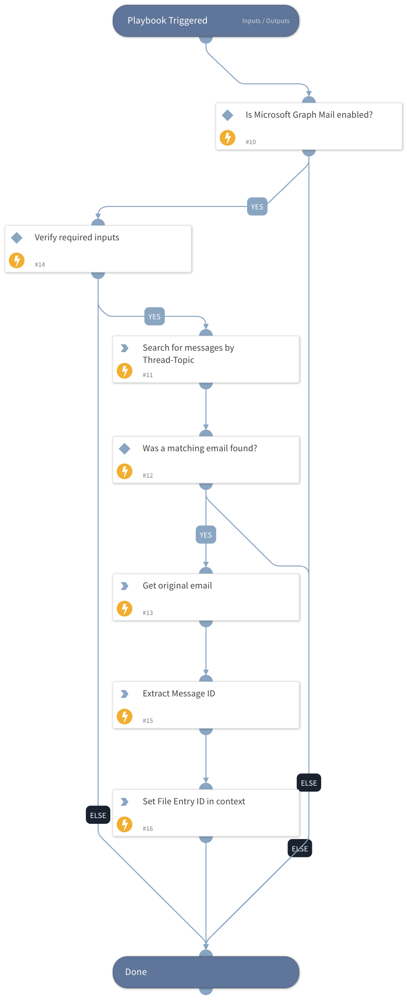

Use this playbook to retrieve the original email in the thread as eml file when the reporting user forwarded the original email not as an attachment.

You must have the necessary permissions in the Microsoft Graph Mail integration to execute global search: eDiscovery

## Dependencies
This playbook uses the following sub-playbooks, integrations, and scripts.

### Sub-playbooks
This playbook does not use any sub-playbooks.

### Integrations
* MicrosoftGraphMail

### Scripts
* Set

### Commands
* msgraph-mail-get-email-as-eml
* msgraph-mail-list-emails

## Playbook Inputs
---

| **Name** | **Description** | **Default Value** | **Required** |
| --- | --- | --- | --- |
| Mailbox | Email address of the reporting user. | incident.emailfrom | Optional |
| InReplyTo | The InReplyTo header in the forwarded email. | incident.phishingreporteremailheaders.headervalue | Optional |
| ThreadTopic | The ThreadTopic header in the forwarded email. | incident.phishingreporteremailheaders.headervalue | Optional |

## Playbook Outputs
---

| **Path** | **Description** | **Type** |
| --- | --- | --- |
| Email | The email object | unknown |
| Email.To | The recipient of the email | string |
| Email.From | The sender of the email | string |
| Email.HTML | The email HTML | string |
| Email.Body | The email text body | string |
| Email.Headers | The email headers | unknown |
| Email.Subject | The email subject | string |
| File | Original attachments | unknown |
| Email.HeadersMap | The headers of the email. | unknown |
| reportedemailentryid | In case the original eml was retrieved, this field will hold the File's Entry ID. | unknown |

## Playbook Image
---
